# Dokument zahtev

|                             |                                                         |
| :-------------------------- | :------------------------------------------------------ |
| **Naziv projekta**          | Dog walkers                               |
| **Člani projektne skupine** | Amadej Šenk Juh, Klemen Krsnik, Miha Jarc, Jan Dominik Bohak in Luka Tomažič |
| **Kraj in datum**           | Ljubljana, 5.4.2021                                 |

## Povzetek projekta

Naša spletna aplikacija rešuje težavo časovne stiske lastnikov psov in ponuja ljubiteljem živali dodaten zaslužek. Slednje smo v naši informacijski rešitvi razdelili na sprehajalce in skrbnike psov. Izdelali smo diagram primerov uporabe, v katerem smo predvideli 5 uporabniških vlog, 17 funkcionalnosti in 6 zunanjih sistemov. Spletna aplikacija bo omogočala registracijo in prijavo, na podlagi katere se bo lahko uporabnik posluževal uporabe večinskega deleža funkcionalnosti, kot so pregled, objava in urejanje oglasov povpraševanj ter storitev. Omogočeno bo tudi ocenjevanje in ogled najboljših ponudnikov storitev ter razvrščanje ponudnikov v čine glede na njihovo uspešnost. Ostale funkcionalnosti služijo kot suplement prej omenjenim funkcionalnostim. 
V okviru našega projekta smo upoštevali tudi vrsto varnostnih postopkov, metodologij, standardov, tehnologij in zakonikov, ki smo jih zajeli v nefunkcionalnih zahtevah. Sklop prototipiranja vmesnikov smo namenili osnutkom zaslonskih mask, ki povezujejo uporabnike aplikacije z našim sistemom, in sistemskim vmesnikom, ki zajemajo povezavo med našim in zunanjim sistemom.

## 1. Uvod

Družba je v trenutnem stanju močno izpostavljena vplivom epidemije Covid-19, zaradi česar ljudje v zadnjem času veliko več časa preživijo doma. Iz aktualnih statističnih podatkov lahko razberemo, da se je veliko ljudi odločilo, da v svoje domove sprejmejo novega družinskega člana - psa. A vendarle se stvari počasi vračajo na stare tire, kar pomeni, da bodo ljudje sčasoma začeli več časa preživljati zdoma, naj si bo to v službi ali na potovanju v oddaljenih krajih. Posledično lahko sklepamo, da bodo imeli lastniki psov vse večji primanjkljaj časa, ki bi ga lahko namenili štirinožnim prijateljem. Naša spletna aplikacija bo naslavljala ta problem in predstavljala čudovit medij med lastniki psov in njihovimi bodočimi, začasnimi skrbniki oziroma sprehajalci. Aplikacija ima lahko pozitiven učinek na obvladovanje časovne stiske lastnikov psov in zmanjševanje števila psov v zavetiščih ter tako prispeva k odgovornemu odnosu družbe do živali.

Uporabniki bodo lahko na spletni aplikaciji sodelovali hkrati v vlogi lastnika psa in ponudnika storitev. To pomeni, da lahko uporabnik prosi za pomoč pri skrbi za psa ali ponuja svojo storitev pri skrbi za pse drugih uporabnikov. Ena izmed glavnih funkcionalnosti našega sistema bo pregled oglasov lastnikov psov, ki potrebujejo določeno storitev in oglasov skrbnikov psov, ki ponujajo svoje storitve. Spletna aplikacija jim bo nudila filtriranje oglasov po različnih parametrih (cena, velikost psa, število psov itd.) in sortiranje oglasov (po ceni navzdol/navzgor, po oceni skrbnika itd.). Ob pregledu oglasa bodo imeli na voljo tudi pregled nad lokacijo uporabnika, ki je ustvaril oglas in napovedanim vremenom na lokaciji. Poleg pregleda oglasov in storitev si bodo uporabniki lahko prebrali najbolj aktualne novice iz sveta psov in ogledali najlepše fotografije psov drugih uporabnikov. Do te funkcionalnosti bodo imeli dostop vsi uporabniki - tako registrirani kot tudi neregistrirani. Neregistrirani uporabniki se bodo lahko naknadno tudi registrirali in prijavili v sistem. Z registracijo bodo ustvarili svoj uporabniški račun in pridobili možnost uporabe številnih funkcionalnosti, kot je na primer ogled in objava oglasov ter storitev. Registriranim uporabnikom bo omogočena delitev oglasov na družbenem omrežju Facebook. Svoje mnenje o storitvi bodo lahko izrazili tako, da bodo skrbnika po opravljeni storitvi ocenili in podali komentar. Skrbniki bodo na podlagi števila opravljenih storitev in ocen uporabnikov razvrščeni v določen razred oziroma skrbniški čin. Elo, ki definira razvrščanje činov, se bo izračunal na podlagi povprečne ocene, ki jo podajo lastniki psov in frekvence oziroma števila do sedaj opravljenih storitev. Registriran uporabnik bo lahko v primeru, da pozabi geslo svojega uporabniškega računa, zamenjal geslo za novega. Za red v spletni aplikaciji bodo skrbeli moderatorji, ki bodo lahko odstranjevali neprimerne ali zastarele oglase.

V okviru nefunkcionalnih zahtev bo zagotovljeno, da bo sistem odgovoril na vse zahteve v manj kot 200 milisekundah, in da bo sistem dostopen najmanj 99,70 % časa. Hkrati bo zagotovljeno, da bo sistem podpiral najmanj 700 hkratnih uporabnikov, in da bo zmožen shraniti podatke o najmanj 200 000 uporabnikih. Za preprečevanje botov, bomo uporabili storitev reCAPTCHA. Ker se zavedamo, da lahko popularnost aplikacije poskoči čez noč, je sistem skalabilen. Za razvoj bo uporabljen sistem za upravljanje z izvorno kodo - Git in tehnologije HTML, CSS, Javascript in Angular. Za shranjevanje podatkov bomo uporabili MySQL podatkovno bazo in podatkovno bazo MongoDB. Za organizacijo dela razvojne skupine bomo uporabili metodologijo Scrum v okviru aplikacije Trello. Poleg tega bodo potrebovali vsi razvijalci dostop do spletne kamere in mikrofona na sestankih in konferencah. Razvojna skupina je zavezana spoštovanju množice zakonikov in pravilnikov, med pomembnejše spadajo GDPR, ZVOP-2 in Zakonski sklop o zaščiti živali. Za pridobitev podatkov od uporabniških vlog bomo uporabili zaslonske maske, za izmenjavo podatkov z zunanjimi sistemi pa bomo uporabili sistemske vmesnike. Naš sistem se bo povezoval z naslednjimi zunanjimi sistemi: Facebook, Twitter, Gmail, Vremenska napoved, Google maps in reCAPTCHA.

## 2. Uporabniške vloge

- **Neregistriran uporabnik** je oseba, ki:
    - ima dostop do pregleda novic v svetu psov in pregleda najlepših slik psov,
    - ima dostop do registracije.
- **Sprehajalec psov** je ponudnik storitev, ki:
    - ima vse privilegije registriranega uporabnika,
    - ima dostop do razvrstitve skrbniškega čina,
    - lahko objavi oglas za sprehajanje psov.
- **Skrbnik psov** je ponudnik storitev, ki:
    - ima vse privilegije registriranega uporabnika,
    - ima dostop do razvrstitve skrbniškega čina,
    - lahko objavi oglas za oskrbo psov.
- **Lastnik psa** je oseba, ki:
    - ima vse privilegije registriranega uporabnika,
    - lahko objavi oglas - povpraševanje,
    - lahko ocenjuje ponudnike storitev po opravljeni storitvi.
- **Moderator spletne strani** je oseba, ki:
    - ima vse privilegije registriranega uporabnika,
    - lahko briše oglase.

V izogib pisanju vseh funkcionalnosti **registriranega uporabnika** si lahko bralec ogleda diagram primerov uporabe v 4. točki.

## 3. Slovar pojmov

| Pojem | Definicija | 
| :------------- | :-------------------------------------------- |
| **Neregistriran uporabnik** | Oseba z omejenim dostopom. Ima dostop le do pregleda novic iz sveta psov in galerije ter registracije. |
| **Sprehajalec psov** | Ponudnik storitev, ki je sprehaja pse. Za svoje storitve objavi oglas v spletni aplikaciji. |
| **Skrbnik psov** | Ponudnik storitev, ki je varuška psom. Za svoje storitve objavi oglas v spletni aplikaciji. |
| **Lastnika psa** | Registriran uporabnik, ki ima v lasti psa in zanj potrebuje potrebno oskrbo, bodisi krajši sprehod bodisi večdnevno varstvo. |
| **Moderator spletne strani** | Oseba, ki vzdržuje spletno aplikacijo in moderira stran z brisanjem neustreznih oglasov. |
| **API** | Vmesnik za namensko programsko opremo. |
| **Twitter** | Spletno družbeno omrežje in mikroblogna storitev, ki svojim uporabnikom omogoča, da med seboj izmenjujejo kratka sporočila. |
| **Facebook** | Družbena spletna stran, ki je bila ustanovljena 4. februarja 2004 v mestu Cambridge v Massachusettsu. |
| **HTML, CSS, JavaScript, Angular** | Tehnologije za razvoj spletnih aplikacij. |
| **Git** | Sistem za upravljanje s izvorno kodo. |
| **Trello** | Aplikacija za planiranje in upravljanje spletno-informacijskih projektov z nekoliko prilagojeno metodologijo Scrum. |
| **SQL** | Poizvedovalni jezik za relacijske podatkovne baze. |
| **MongoDB** | Program za dokumentno orientirane (nerelacijske) podatkovne baze. Za shranjevanje potrebuje JSON datoteke. |
| **Scrum** | Agilna metoda, ki se osredotoča na upravljanje iterativnega razvoja programske opreme in ne na sprecifične prakse agilnega razvoja. |
| **Registracijski obrazec** | Zaslonska maska, preko katere si neregistriran uporabnik ustvari nov uporabniški račun. |
| **reCAPTCHA** | Sistem po principu izziv-odziv (angl. challenge-response), ki omogoča spletnim gostiteljem, da razločijo človeške uporabnike in avtomatizirane skripte uporabnikov (robote). |
| **Registracija** | Postopek, preko katerega si neregistriran uporabnik ustvari nov uporabniški račun. |
| **Prijava** | Postopek preko katerega se registrirani uporabnik prijavi s svojimi podatki v sistem. |
| **Delitev oglasa** | Postopek, preko katerega uporabnik deli vsebino oglasa naše spletne aplikacije na neko drugo spletno mesto – Facebook ipd. |
| **Top10** | Lestvica najboljših 10 ponudnikov storitev na naši spletni aplikaciji. |
| **Dodajanje med priljubljene** | Postopek, pri katerem si lastnik psa doda na vrh seznama oglasov ponudnike storitve, ki so svoje delo dobro opravili in bi želel, da so tudi v bodoče njegovi ponudniki. |
| **Glifikon** | Simbol za neko dejavnost ali aktivnost, denimo rdeč križec, zelena kljukica ipd. |
| **Razvrstitev skrbniškega čina** | Postopek, pri katerem se ob vsaki ocenjeni storitvi izvede ponovno preračunavanje točk – elo - in posledično dodeljevanje temu ustreznega skrbniškega čina. Pri razvrstitvi v nek razred – čin - se upoštevata ocena lastnika psa in število dosedanjih opravljenih storitev. |
| **Objava oglasa** | Postopek, pri katerem registriran uporabnik doda svoje povpraševanje/storitev na seznam, katerega si lahko vsi ogledajo. |
| **Urejanje oglasa** | Postopek, pri katerem uporabnik spremeni podatke v svojem profilu. |
| **Ponastavitev gesla** | Postopek, pri katerem uporabnik  preko zunanjega sistema elektronske pošte spremeni svoje staro geslo, saj ga bodisi več ne pozna ali pa ga želi zamenjati iz drugih razlogov. |
| **Galerija** | Interaktivno se premikajoča kaskada slik (v našem primeru slike psov). |
| **GDPR** | angl. General Data Protection Regulation, je uredba Evropske unije, na podlagi katere so Evropski parlament, Evropski svet in Evropska komisija okrepili in poenotili zaščito podatkov o vseh osebah znotraj Evropske unije. |
| **Interaktivni gumb** | Gumb, na katerega lahko klikne uporabnik v sklopu določene zaslonske maske. |
| **Hashiranje informacij** | Postopek, pri katerem se nek niz pretvori v neko binarno število na podlagi predpisane zgoščevalne funkcije (angl. hash function). Na ta način povečujemo varnost podatkov. |
| **Programski modul** | Sklop programske opreme na osnovi natančno predpisane funkcionalnosti. |
| **Webstorm** | Primer integriranega razvojnega okolja (angl. integrated development environment). |
| **MySQL** | Sistem za upravljanje z relacijsko podatkovno bazo. |
| **ZVOP-2** | Zakon o varstvu osebnih podatkov, izdaja 2. |
| **Domača stran** | Stran, katera se prikaže, ko uporabnik prvič v seji vstopi v sistem naše spletne aplikacije. |
| **OpenWeatherMap** | Aplikacija za vremensko napoved. |
| **Google Maps** | Aplikacija za prikaz zemljevida. |
| **PRM** | angl. Performance rating management, je standard za načine dodajanja priljubljenih objektov in subjektov. |
| **Glicko-2 rating system** | Sistem za izračun točk – elo na podlagi nekih parametrov. |
| **Elo** | Algoritmično določena ocena na podlagi ključnih faktorjev (ocene, frekvence, ...) |
| **Novi oglas** | Oglas, ki ga bomo kasneje kreirali. |
| **Bot** | Avtomatiziran uporabnik, ki deluje preko skripte. |
| **Vloga** | Ekvivalent registriranemu uporabniku. |
| **Zaslonska maska** | Posamezen del uporabniškega vmesnika, preko katerega dobimo vhodne podatke od uporabniških vlog našega informacijskega sistema. |
| **RFC** | angl. *Request for comments*, zahteva za mnenja. Dokument, ki določa tehnične vidike interneta. |
| **Povpraševanje** | Tip oglasa, pri katerem lastnik psa potrebuje ponudnika storitev za opravljanje nekega dela. |
| **Storitev** | Tip oglasa, pri katerem ponudnik storitev ponuja svoje usluge. |
| **Nielsenovi principi** | Principi za smiselno postavitev grafičnih in interaktivnih elementov. |

## 4. Diagram primerov uporabe

 

## 5. Funkcionalne zahteve

Funkcionalne zahteve so sklopi, ki predstavljajo funkcionalnosti našega sistema. Vsaka funkcionalnost vsebuje **povzetek funkcionalnosti**, **osnovni tok**, po možnosti tudi **alternativni** ali **celo izjemni tok**. Vsaka funkcionalnost ni na voljo v vsakem stanju spletne aplikacije, zato podamo tudi **pogoj**, kdaj se izvede. Vsaka funkcionalnost ima svoj končni pričakovani cilj, kar smo označili s **posledico**. Nekatere funkcionalnosti pa imajo tudi kakšno **posebnost**, ki ni prisotna pri ostalih funkcionalnostih.
Na koncu napišemo tudi **sprejemne teste** za vsak tok dogodkov.

### 1. Registracija

#### Povzetek funkcionalnosti

Neregistriran uporabnik se lahko registrira in s tem pridobi dostop do več funkcionalnosti. Pri registraciji izpolni obrazec s svojim e-poštnim naslovom, uporabniškim imenom, geslom, rojstnim datumom in vlogo (lastnik psa ali ponudnik storitev).

#### Osnovni tok

1. Neregistriran uporabnik klikne na gumb Registracija.
2. Spletna aplikacija ponudi neregistriranemu uporabniku registracijski obrazec.
3. Neregistriran uporabnik v registracijski obrazec vpiše svoj e-poštni naslov, uporabniško ime, geslo, potrditveno geslo in rojstni datum.
4. Neregistriran uporabnik v spodnjem delu registracijskega obrazca izbere najmanj eno vlogo.
5. Neregistriran uporabnik označi, da ni robot (reCAPTCHA).
6. Neregistriran uporabnik klikne na gumb Registriraj se.
7. Spletna aplikacija neregistriranemu uporabniku pošlje sporočilo za potrditev registracije na e-poštni naslov.
8. Po potrjeni registraciji spletna aplikacija neregistriranega uporabnika preusmeri na domačo stran in mu prikaže sporočilo "Uspešna registracija".

**Razširitvena točka:** Prijava v sistem

**Pogoj:** Uporabnik klikne na gumb Prijava

#### Izjemni tokovi

* #### Izjemni tok 1

Neregistriran uporabnik v obrazec za registracijo vnese e-poštni naslov, ki ni v veljavni obliki. Spletna aplikacija neregistriranemu uporabniku prikaže ustrezno sporočilo.

* #### Izjemni tok 2

Neregistriran uporabnik v obrazec za registracijo vnese e-poštni naslov, ki v sistemu že obstaja. Spletna aplikacija neregistriranemu uporabniku prikaže ustrezno sporočilo.

* #### Izjemni tok 3

Neregistriran uporabnik v obrazec za registracijo vnese uporabniško ime, ki ni v veljavni obliki. Spletna aplikacija neregistriranemu uporabniku prikaže ustrezno sporočilo.

* #### Izjemni tok 4

Neregistriran uporabnik v obrazec za registracijo vnese uporabniško ime, ki v sistemu že obstaja. Spletna aplikacija neregistriranemu uporabniku prikaže ustrezno sporočilo.

* #### Izjemni tok 5

Neregistriran uporabnik v obrazec za registracijo vnese geslo, ki ne ustreza pogojem. Spletna aplikacija neregistriranemu uporabniku prikaže ustrezno sporočilo.

* #### Izjemni tok 6

Neregistriran uporabnik v obrazec za registracijo vnese potrditveno geslo, ki se ne ujema z geslom. Spletna aplikacija neregistriranemu uporabniku prikaže ustrezno sporočilo.

* #### Izjemni tok 7

Neregistriran uporabnik v obrazcu za registracijo ne izbere vsaj ene vloge. Privzeto je izbrana vloga Lastnik psa. Spletna aplikacija neregistriranemu uporabniku prikaže ustrezno sporočilo.

#### Pogoji

Pri funkcionalnosti Registracija uporabnik ne sme biti prijavljen. Če je uporabnik prijavljen mu ta funkcionalnost ni na voljo.

#### Posledice

Če se neregistriran uporabnik uspešno registrira, je zabeležen v sistemu in se sedaj lahko v aplikacijo prijavi s svojimi podatki. Uporabnik s tem dobi dostop do več funkcionalnosti aplikacije.

#### Posebnosti

Uporabnik mora v obrazec za registracijo vpisati e-poštni naslov, ki mora ustrezati regularnemu izrazu; uporabniško ime, ki mora biti dolžine med 4 in 15 znakov; geslo, ki mora biti dolžine med 8 in 30 znakov, vsebovati pa mora vsaj 1 veliko črko, vsaj 1 poseben znak ter vsaj 1 števko; potrditveno geslo, ki se mora ujemati z geslom. Pri tej funkcionalnosti sledimo standardu RFC 2822. V registracijo smo vključili tudi strinjanje s splošnimi pogoji uporabe. Podatki se pošiljajo po varni povezavi in so hranjeni z ustreznimi varnostnimi praksami. Pošiljanje e-pošte se izvaja s pomočjo zunanjega sistema - Gmail.

#### Prioritete identificiranih funkcionalnosti

MUST have.

#### Sprejemni testi

| Primer uporabe | Vrsta toka | Funkcija, ki se testira | Začetno stanje sistema | Vhod | Pričakovan rezultat |
| :------------- | :---------------------- | :---------------------- | :--------------------- | :--- | :------------------ |
| Registracija | Osnovni tok | Dodajanje novega uporabnika v sistem | Neregistriran uporabnik se ne nahaja v sistemu | E-poštni naslov, uporabniško ime, geslo, potrditveno geslo, (izbrane) vloge, klik na označbo ReCAPTCHA, klik na gumb Registriraj se | V sistem je dodan registriran uporabnik |
| Registracija | Izjemni tok 1 | Vnešen e-poštni naslov ni v veljavni obliki | Prazno vnosno polje za e-poštni naslov | Neveljaven e-poštni naslov | Sporočilo neregistriranemu uporabniku, da e-poštni naslov ni v veljavni obliki |
| Registracija | Izjemni tok 2 | Vnešen e-poštni naslov v sistemu že obstaja | Prazno vnosno polje za e-poštni naslov | Že obstoječ e-poštni naslov | Sporočilo neregistriranemu uporabniku, da uporabnik s tem e-poštnim naslovom že obstaja |
| Registracija | Izjemni tok 3 | Vnešeno uporabniško ime ni v veljavni obliki | Prazno vnosno polje za uporabniško ime | Neveljavno uporabniško ime | Sporočilo neregistriranemu uporabniku, da uporabniško ime ni v veljavni obliki |
| Registracija | Izjemni tok 4 | Vnešeno uporabniško ime v sistemu že obstaja | Prazno vnosno polje za uporabniško ime | Že obstoječe uporabniško ime | Sporočilo neregistriranemu uporabniku, da uporabnik s tem uporabniškim imenom že obstaja |
| Registracija | Izjemni tok 5 | Vnešeno geslo ni v ustrezni obliki | Prazno vnosno polje za novo geslo | Neveljavno geslo | Sporočilo neregistriranemu uporabniku, da geslo ni v ustrezni obliki |
| Registracija | Izjemni tok 6 | Vnešeno potrditveno geslo se ne ujema z geslom | Prazno vnosno polje za potrditveno geslo | Neujemajoče potrditveno geslo | Sporočilo neregistriranemu uporabniku, da se potrditveno geslo ne ujema z geslom |
| Registracija | Izjemni tok 7 | Izbira nobene vloge | Neoznačene izbira vlog | Nobena vloga ni izbrana | Sporočilo neregistriranemu uporabniku, da ni izbrana vsaj 1 vloga |

### 2. Prijava v sistem

#### Povzetek funkcionalnosti

Registriran uporabnik se lahko prijavi v spletno aplikacijo s podatki, ki jih je vnesel pri registraciji. Moderator pa se prijavi v spletno aplikacijo s podatki, ki so mu jih posredovali razvijalci aplikacije. S tem pridobijo dostop do več funkcionalnosti. Pri prijavi izpolni obrazec s svojim e-poštnim naslovom in geslom.

#### Osnovni tok

1. Registriran uporabnik klikne na gumb Prijava.
2. Spletna aplikacija ponudi registriranemu uporabniku prijavni obrazec.
3. Registriran uporabnik v prijavni obrazec vpiše svoj e-poštni naslov ter geslo, ki ju je navedel ob registraciji.
4. Registriran uporabnik označi, da ni robot (reCAPTCHA).
5. Registriran uporabnik klikne na gumb Prijavi se.
7. Po prijavi spletna aplikacija registriranega uporabnika preusmeri na domačo stran, ki vsebuje dodatno pridobljene funkcionalnosti.

**Razširitvena točka:** Ponastavitev gesla

**Pogoj:** Uporabnik klikne na gumb Pozabljeno geslo.

#### Izjemni tokovi

* #### Izjemni tok 1

Registriran uporabnik v obrazec za prijavo vnese e-poštni naslov in geslo, pri tem pa se en ali oba podatka ne ujemata z vrednostmi v podatkovni bazi. Spletna aplikacija registriranemu uporabniku prikaže ustrezno sporočilo ob kliku na gumb Prijavi se.

#### Pogoji

Pri funkcionalnosti Prijava v sistem se mora uporabnik že predhodno registrirati. Če je uporabnik že prijavljen mu ta funkcionalnost ni na voljo.

#### Posledice

Če se registriran uporabnik uspešno prijavi, s tem dobi dostop do več funkcionalnosti aplikacije.

#### Posebnosti

Podatki o prijavi se pošiljajo po varni povezavi in so hranjeni z ustreznimi varnostnimi praksami.

#### Prioritete identificiranih funkcionalnosti

MUST have.

#### Sprejemni testi

| Primer uporabe | Vrsta toka | Funkcija, ki se testira | Začetno stanje sistema | Vhod | Pričakovan rezultat |
| :------------- | :---------------------- | :---------------------- | :--------------------- | :--- | :------------------ |
| Prijava v sistem | Osnovni tok | Prijava registriranega uporabnika v spletno aplikacijo | Registriran uporabnik ni prijavljen v spletno aplikacijo | E-poštni naslov in geslo | Registriran uporabnik je prijavljen v spletno aplikacijo |
| Prijava v sistem | Izjemni tok 1 | Prijava registriranega uporabnika z napačnim e-poštnim naslovom ali geslom | Prazno vnosno polje za e-poštni naslov in geslo | Napačen e-poštni naslov ali geslo | Sporočilo registriranemu uporabniku, da uporabnik s tem e-poštnim naslovom ne obstaja ali pa je geslo nepravilno|

### 3. Ponastavitev gesla

#### Povzetek funkcionalnosti

Registriran uporabnik lahko v primeru, da pozabi svoje geslo, pridobi novega. Pri tem izpolni obrazec za ponastavitev gesla s svojim e-poštnim naslovom. Naknadno izpolni še obrazec za nastavitev novega gesla.

#### Osnovni tok

1. Registriran uporabnik klikne na gumb Pozabljeno geslo na strani za prijavo.
2. Spletna aplikacija ponudi registriranemu uporabniku obrazec za ponastavitev gesla.
3. Registriran uporabnik v obrazec za ponastavitev gesla vpiše svoj e-poštni naslov.
4. Registriran uporabnik klikne na gumb Pošlji mi geslo.
5. Spletna aplikacija registriranemu uporabniku na e-poštni naslov pošlje sporočilo s povezavo na stran za nastavitev novega gesla.
6. Po kliku na povezavo spletna aplikacija neregistriranega uporabnika preusmeri na stran, ki vsebuje obrazec za nastavitev novega gesla.
7. Registriran uporabnik v obrazec za nastavitev novega gesla vpiše geslo in potrditveno geslo.
8. Registriran uporabnik klikne na gumb Potrdi.
9. Spletna aplikacija registriranega uporabnika preusmeri na stran za prijavo.

#### Izjemni tokovi

* #### Izjemni tok 1

Registriran uporabnik v obrazec za ponastavitev gesla vnese e-poštni naslov, ki v sistemu ne obstaja. Spletna aplikacija registriranemu uporabniku prikaže ustrezno sporočilo.

* #### Izjemni tok 2

Registriran uporabnik v obrazec za nastavitev novega gesla vpiše geslo, ki ni v ustrezni obliki. Spletna aplikacija registriranemu uporabniku prikaže ustrezno sporočilo.

* #### Izjemni tok 3

Registriran uporabnik v obrazec za nastavitev novega gesla vpiše potrditveno geslo, ki se ne ujema z geslom. Spletna aplikacija registriranemu uporabniku prikaže ustrezno sporočilo.

#### Pogoji

Pri funkcionalnosti Ponastavitev gesla se mora uporabnik že predhodno registrirati. Če je uporabnik že prijavljen mu ta funkcionalnost ni na voljo.

#### Posledice

Če registriran uporabnik uspešno ponastavi geslo, se v sistemu zabeleži novo geslo, s katerim se lahko prijavi v spletno aplikacijo.

#### Posebnosti

Uporabnik mora v obrazec za ponastavitev gesla vpisati e-poštni naslov, ki mora ustrezati regularnemu izrazu. V obrazec za nastavitev novega gesla mora uporabnik vpisati novo geslo, ki mora biti dolžine med 8 in 30 znakov, vsebovati pa mora vsaj 1 veliko črko, vsaj 1 poseben znak ter vsaj 1 števko ter potrditveno geslo, ki se mora ujemati z geslom. Podatki o geslu se pošiljajo in shranjujejo z ustreznimi varnostnimi praksami. Pošiljanje e-pošte se izvaja s pomočjo zunanjega sistema - Gmail.

#### Prioritete identificiranih funkcionalnosti

COULD have.

#### Sprejemni testi

| Primer uporabe | Vrsta toka | Funkcija, ki se testira | Začetno stanje sistema | Vhod | Pričakovan rezultat |
| :------------- | :---------------------- | :---------------------- | :--------------------- | :--- | :------------------ |
| Ponastavitev gesla | Osnovni tok | Ponastavljanje gesla registriranega uporabnika | V sistemu zabeleženo trenutno geslo | E-poštni naslov, novo geslo in potrditveno geslo ter klik na gumb za potrditev ponastavitve | V sistemu zabeleženo novo geslo |
| Ponastavitev gesla | Izjemni tok 1 | Ponastavljanje gesla z neobstoječim e-poštnim naslovom v našem sistemu | Prazno vnosno polje za e-poštni naslov | Neobstoječ e-poštni naslov ter klik na potrditev ponastavitve gesla | Sporočilo uporabniku, da uporabnik s tem e-poštnim naslovom ne obstaja |
| Ponastavitev gesla | Izjemni tok 2 | Ponastavljanje gesla z novim geslom v neustrezni obliki | Prazno vnosno polje za novo geslo | E-poštni naslov in novo geslo | Sporočilo uporabniku, da geslo ni v ustrezni obliki |
| Ponastavitev gesla | Izjemni tok 3 | Ponastavljanje gesla z neujemajočim se potrditvenim geslom | Prazno vnosno polje za potrditveno geslo | Potrditveno geslo | Sporočilo uporabniku, da se potrditveno geslo ne ujema z geslom|

### 4. Pregled oglasa

#### Povzetek funkcionalnosti

Registriran uporabnik si lahko ogleda oglase, ki jih objavljajo lastniki psov in ponudniki storitev.

#### Osnovni tok 1 - Povpraševanja

1. Registriran uporabnik klikne na povezavo Povpraševanja v navigacijskem meniju.
2. Spletna aplikacija registriranemu uporabniku prikaže seznam z oglasi lastnikov - povpraševanji.
3. Registrirani uporabnik klikne na oglas, ki si ga želi ogledati.
4. Spletna aplikacija registriranemu uporabniku prikaže podrobnosti oglasa, na katerega je kliknil.

**Razširitvena točka:** Pregled profila

**Pogoj:** Uporabnik klikne na ime uporabnika.

**Razširitvena točka:** Rezervacija

**Pogoj:** Uporabnik klikne na gumb Rezervacija.

**Razširitvena točka:** Delitev oglasa

**Pogoj:** Uporabnik klikne na Facebook glifikon.

#### Osnovni tok 2 - Storitve

1. Registriran uporabnik klikne na povezavo Storitve v navigacijskem meniju.
2. Spletna aplikacija registriranemu uporabniku prikaže seznam z oglasi ponudnikov - storitvami.
3. Registrirani uporabnik klikne na oglas, ki si ga želi ogledati.
4. Spletna aplikacija registriranemu uporabniku prikaže podrobnosti oglasa, na katerega je kliknil.

#### Pogoji

Pri funkcionalnosti Pregled oglasa mora uporabnik biti prijavljen. Če uporabnik ni prijavljen mu ta funkcionalnost ni na voljo.

#### Posledice

Po kliku na točno določen oglas, si lahko uporabnik ogleda podrobne informacije o le-tem.

#### Posebnosti

Pri postavitvi elementov na strani z oglasi, natančneje sledimo Nielsenovim principom za postavitev grafičnih gradnikov.

#### Prioritete identificiranih funkcionalnosti

MUST have.

#### Sprejemni testi

| Primer uporabe | Vrsta toka | Funkcija, ki se testira | Začetno stanje sistema | Vhod | Pričakovan rezultat |
| :------------- | :---------------------- | :---------------------- | :--------------------- | :--- | :------------------ |
| Pregled oglasa | Osnovni tok 1 | Prikaz seznama oglasov povpraševanj | Uporabnik se ne nahaja na strani z oglasi povpraševanj | Klik na povezavo Povpraševanja v navigacijskem meniju | Uporabnik se nahaja na strani z seznamom povpraševanj |
| Pregled oglasa | Osnovni tok 1 | Prikaz podrobnosti oglasa povpraševanja | Uporabnik se nahaja na strani z seznamom povpraševanj | Klik na oglas povpraševanja | Uporabnik se nahaja na strani, kjer se nahajajo podrobnosti oglasa povpraševanja |
| Pregled oglasa | Osnovni tok 2 | Prikaz seznama oglasov storitev | Uporabnik se ne nahaja na strani z oglasi storitev | Klik na povezavo Storitve v navigacijskem meniju | Uporabnik se nahaja na strani z oglasi storitev |
| Pregled oglasa | Osnovni tok 2 | Prikaz podrobnosti oglasa storitve | Uporabnik se nahaja na strani z oglasi storitev | Klik na oglas storitve | Uporabnik se nahaja na strani, kjer se nahajajo podrobnosti oglasa storitve |

### 5. Objava oglasa

#### Povzetek funkcionalnosti

Registriran uporabnik lahko objavlja oglase, ki se po objavi pojavijo na strani z oglasi. Pri tem izpolni obrazec za objavo oglasa.

#### Osnovni tok 1 - povpraševanje

1. Registriran uporabnik klikne na povezavo Objavi v navigacijskem meniju.
2. Spletna aplikacija ponudi registriranemu uporabniku obrazec za objavo oglasa.
4. Registriran uporabnik v obrazec za objavo oglasa vnese naslov oglasa, datum in čas, ko potrebuje storitev ali storitev lahko nudi, trajanje storitve, kraj, kontakt in opis zahtev povpraševanja oz. storitve.
5. Registriran uporabnik označi okvirček Povpraševanje.
6. Registriran uporabnik klikne na gumb Objavi oglas.
7. Spletna aplikacija registriranega uporabnika preusmeri na profil uporabnika, kjer so vidni njegovi oglasi.

**Razširitvena točka:** Urejanje oglasa

**Pogoj:** Uporabnik klikne na gumb Uredi.

#### Osnovni tok 2 - storitev

1. Registriran uporabnik klikne na povezavo Objavi v navigacijskem meniju.
2. Spletna aplikacija ponudi registriranemu uporabniku obrazec za objavo oglasa.
4. Registriran uporabnik v obrazec za objavo oglasa vnese naslov oglasa, datum in čas, ko potrebuje storitev ali storitev lahko nudi, trajanje storitve, kraj, kontakt in opis zahtev povpraševanja oz. storitve.
5. Registriran uporabnik označi okvirček Storitev.
6. Registriran uporabnik klikne na gumb Objavi oglas.
7. Spletna aplikacija registriranega uporabnika preusmeri na profil uporabnika, kjer so vidni njegovi oglasi.

#### Pogoji

Pri funkcionalnosti Objava oglasa mora uporabnik biti prijavljen. Če uporabnik ni prijavljen mu ta funkcionalnost ni na voljo.

#### Posledice

Če uporabnik objavi oglas, se oglas zabeleži v sistem in prikaže med oglasi na strani z oglasi.

#### Posebnosti

Pri funkcionalnosti Objava oglasa sledimo standardom IPA.

#### Prioritete identificiranih funkcionalnosti

MUST have.

#### Sprejemni testi

| Primer uporabe | Vrsta toka | Funkcija, ki se testira | Začetno stanje sistema | Vhod | Pričakovan rezultat |
| :------------- | :---------------------- | :---------------------- | :--------------------- | :--- | :------------------ |
| Objava oglasa | Osnovni tok 1 - povpraševanje | Prikaz objavljenega oglasa na strani z oglasi povpraševanja | Seznam oglasov povpraševanja ne vsebuje novega oglasa | Naslov oglasa, datum in čas, trajanje, kraj, kontakt in opis zahtev, označba okvirčka Povpraševanje in klik na gumb Objavi oglas | Seznam oglasov povpraševanja vsebuje nov oglas |
| Objava oglasa | Osnovni tok 2 - storitev | Prikaz objavljenega oglasa na strani z oglasi storitev | Seznam oglasov storitev ne vsebuje novega oglasa | Naslov oglasa, datum in čas, trajanje, kraj, kontakt in opis zahtev, označba okvirčka Storitev in klik na gumb Objavi oglas | Seznam oglasov storitev vsebuje nov oglas |

### 6. Urejanje oglasa

#### Povzetek funkcionalnosti

Registriran uporabnik lahko ureja svoje oglase. Pri tem izpolni obrazec za urejanje oglasa.

#### Osnovni tok

1. Registriran uporabnik klikne na povezavo Moj profil v navigacijskem meniju.
2. Spletna aplikacija registriranemu uporabniku odpre stran, ki vsebuje podrobnosti o njegovem profilu in njegove objave.
3. Registriran uporabnik klikne na gumb Uredi, ki se nahaja poleg oglasa, ki ga želi urediti.
4. Spletna aplikacija ponudi registriranemu uporabniku obrazec za urejanje oglasa.
5. Registriran uporabnik v obrazcu za urejanje oglasa popravi vnose ali na novo vnese naslov oglasa, datum in čas, ko potrebuje storitev ali storitev lahko nudi, trajanje storitve, kraj, kontakt in opis zahtev povpraševanja oz. storitve.
6. Registriran uporabnik klikne na gumb Potrdi.
7. Spletna aplikacija registriranega uporabnika preusmeri na stran z oglasi.

#### Pogoji

Pri funkcionalnosti Urejanje oglasa mora uporabnik biti prijavljen. Če uporabnik ni prijavljen mu ta funkcionalnost ni na voljo.

#### Posledice

Če uporabnik uredi oglas, se spremembe pri oglasu zabeležijo v sistem in prikažejo v oglasu na strani z oglasi.

#### Posebnosti

Pri funkcionalnosti Urejanje oglasa sledimo standardom IPA.

#### Prioritete identificiranih funkcionalnosti

COULD have.

#### Sprejemni testi

| Primer uporabe | Vrsta toka | Funkcija, ki se testira | Začetno stanje sistema | Vhod | Pričakovan rezultat |
| :------------- | :---------------------- | :---------------------- | :--------------------- | :--- | :------------------ |
| Urejanje oglasa | Osnovni tok | Prikaz sprememb oglasa na strani s podrobnostmi oglasa | Stran s podrobnostmi oglasa vsebuje trenutne podatke o oglasu | Nov datum in čas | Stran s podrobnostmi oglasa vsebuje nove podatke o oglasu |

### 7. Pregled profila

#### Povzetek funkcionalnosti

Registriran uporabnik lahko pregleduje profile drugih uporabnikov ali svoj profil.

#### Osnovni tok

1. Registriran uporabnik klikne na povezavo Povpraševanje/Storitve v navigacijskem meniju.
2. Spletna aplikacija registriranemu uporabniku prikaže seznam z oglasi.
3. Registrirani uporabnik klikne na ime uporabnika, ki je objavil določen oglas in si ga želi ogledati.
4. Spletna aplikacija registriranega uporabnika preusmeri na stran s podatki uporabniškega profila, na katerega je kliknil.

#### Pogoji

Pri funkcionalnosti Pregled profila mora uporabnik biti prijavljen. Če uporabnik ni prijavljen mu ta funkcionalnost ni na voljo.

#### Posledice

Ogled profila.

#### Posebnosti

Pri funkcionalnosti Pregled profila sledimo standardom IPA.

#### Prioritete identificiranih funkcionalnosti

MUST have.

#### Sprejemni testi

| Primer uporabe | Vrsta toka | Funkcija, ki se testira | Začetno stanje sistema | Vhod | Pričakovan rezultat |
| :------------- | :---------------------- | :---------------------- | :--------------------- | :--- | :------------------ |
| Pregled profila | Osnovni tok | Prikaz strani s podrobnostmi uporabniškega profila | Uporabnik se nahaja na strani z oglasi | Klik na uporabniško ime | Uporabniku se prikaže stran s podatki uporabniškega profila, na katerega je kliknil |

### 8. Pregled najboljših ponudnikov

#### Povzetek funkcionalnosti

Registriran uporabnik lahko pregleda seznam 10 najboljših ponudnikov.

#### Osnovni tok

1. Registriran uporabnik klikne na povezavo Top 10 v navigacijskem meniju.
2. Spletna aplikacija registriranemu uporabniku prikaže stran z 10 najboljšimi ponudniki.

#### Pogoji

Pri funkcionalnosti Pregled najboljših ponudnikov mora uporabnik biti prijavljen. Če uporabnik ni prijavljen mu ta funkcionalnost ni na voljo.

#### Posledice

Prikaz seznama 10 najboljših ponudnikov.

#### Posebnosti

Pri funkcionalnosti Pregled najboljših ponudnikov sledimo zakoniku GDPR.

#### Prioritete identificiranih funkcionalnosti

COULD have.

#### Sprejemni testi

| Primer uporabe | Vrsta toka | Funkcija, ki se testira | Začetno stanje sistema | Vhod | Pričakovan rezultat |
| :------------- | :---------------------- | :---------------------- | :--------------------- | :--- | :------------------ |
| Pregled najboljših ponudnikov | Osnovni tok | Prikaz strani z 10 najboljšimi ponudniki | Uporabnik se nahaja na domači strani | Klik na povezavo Top 10 | Uporabniku se prikaže stran z 10 najboljšimi ponudniki |

### 9. Ocenjevanje ponudnikov

#### Povzetek funkcionalnosti

Registriran uporabnik lahko ocenjuje ponudnike. Pri tem izpolni obrazec za ocenitev ponudnika.

#### Osnovni tok

1. Lastnik psa po preteku roka opravljanja storitve klikne na povezavo v navigacijskem meniju Moj profil.
2. Spletna aplikacija lastniku prikaže stran s podrobnostmi njegovega profila.
3. Lastnik psa v spodnjem delu strani klikne na gumb Oceni, ki se nahaja poleg že pretekle storitve.
4. Spletna aplikacija lastniku prikaže obrazec za ocenjevanje.
5. Lastnik psa izbere okvirček Storitev se je izvedla.
6. Lastnik psa v obrazec za ocenjevanje vnese svojo oceno in komentar storitve.
7. Lastnik psa klikne na gumb Potrdi.
8. Spletna aplikacija lastniku psa prikaže stran s podatki o njegovem profilu.

**Razširitvena točka:** Dodajanje med priljubljene

**Pogoj:** Uporabnik klikne na gumb Dodaj med priljubljene.

#### Alternativni tok

1. Lastnik psa po preteku roka opravljanja storitve klikne na povezavo v navigacijskem meniju Moj profil.
2. Spletna aplikacija lastniku prikaže stran s podrobnostmi njegovega profila.
3. Lastnik psa v spodnjem delu strani klikne na gumb Oceni, ki se nahaja poleg že pretekle storitve.
4. Spletna aplikacija lastniku prikaže obrazec za ocenjevanje.
5. Lastnik psa izbere okvirček Storitev se ni izvedla.
6. Spletna aplikacija lastniku psa onemogoči vnos ocene in komentarja storitve.
7. Lastnik psa klikne na gumb Potrdi.
8. Spletna aplikacija lastniku psa prikaže stran s podatki o njegovem profilu.

#### Pogoji

Pri funkcionalnosti Ocenjevanje uporabnikov mora uporabnik biti v vlogi lastnika psa. Lastnik psa mora imeti na voljo storitev za ocenjevanje.

#### Posledice

Če lastnik psa doda uceno ponudniku, se ocena zabeleži v sistem in prikaže na profilu ponudnika. Ustrezno se posodobi tudi čin in lestvica najboljših ponudnikov.

#### Posebnosti

Pri funkcionalnosti Ocenjevanje ponudnikov sledimo zakoniku GDPR.

#### Prioritete identificiranih funkcionalnosti

COULD have.

#### Sprejemni testi

| Primer uporabe | Vrsta toka | Funkcija, ki se testira | Začetno stanje sistema | Vhod | Pričakovan rezultat |
| :------------- | :---------------------- | :---------------------- | :--------------------- | :--- | :------------------ |
| Ocenjevanje uporabnikov | Osnovni tok | Prikaz pretekle storitve na profilu lastnika psa | Profil lastnika psa vsebuje neocenjeno storitev | Označba okvirčka Storitev se je izvedla, komentar, ocena in klik na gumb Potrdi | Profil lastnika psa ne vsebuje neocenjene storitve in ocena ponudnika storitev se spremeni |
| Ocenjevanje uporabnikov | Alternativni tok | Prikaz pretekle storitve na profilu lastnika psa | Profil lastnika psa vsebuje neocenjeno storitev | Označba okvirčka Storitev se ni izvedla in klik na gumb Potrdi | Profil lastnika psa ne vsebuje neocenjene storitve in ocena ponudnika storitev se ne spremeni |

### 10. Rezervacija

#### Povzetek funkcionalnosti

Registriran uporabnik lahko rezervira storitev ali povpraševanje.

#### Osnovni tok 1 - Lastnik psa

1. Lastnik psa klikne na gumb Rezervacija na strani s podrobnostmi oglasa storitve.
2. Spletna aplikacija prikaže pogovorno okno: "Želite res rezervirati to storitev?" in možnosti DA/NE.
3. Lasntik psa klikne DA.
4. Spletna aplikacija onemogoči gumb Rezervacija za vse uporabnike.
5. Spletna aplikacija doda rezerviran oglas na profil lastnika psa.

#### Osnovni tok 2 - Ponudnik storitev

1. Ponudnik storitev klikne na gumb Rezervacija na strani s podrobnostmi oglasa povpraševanja.
2. Spletna aplikacija prikaže pogovorno okno: "Želite res rezervirati to storitev?" in možnosti DA/NE.
3. Ponudnik storitev klikne DA.
4. Spletna aplikacija onemogoči gumb Rezervacija za vse uporabnike.
5. Spletna aplikacija doda rezerviran oglas na profil ponudnika storitev.

#### Pogoji

Pri funkcionalnosti Rezervacija mora biti uporabnik prijavljen. Oglas, ki ga uporabnik želi rezervirati ne sme biti že rezerviran.

#### Posledice

Gumb Rezervacija se onemogoči. Oglas se pojavi na profilu uporabnika, ki je oglas rezerviral.

#### Posebnosti

Pri funkcionalnosti Ocenjevanje ponudnikov sledimo zakoniku GDPR.

#### Prioritete identificiranih funkcionalnosti

COULD have.

#### Sprejemni testi

| Primer uporabe | Vrsta toka | Funkcija, ki se testira | Začetno stanje sistema | Vhod | Pričakovan rezultat |
| :------------- | :---------------------- | :---------------------- | :--------------------- | :--- | :------------------ |
| Rezervacija | Osnovni tok 1 - Lastnik psa | Onemogočitev gumba Rezervacija in prikaz oglasa na profilu lastnika psa | Gumb Rezervacija je omogočen, profil lastnika psa ne vsebuje oglasa | Klik na gumb Rezervacija in klik na gumb DA | Gumb Rezervacija je onemogočen, profil lastnika psa vsebuje oglas |
| Rezervacija | Osnovni tok 2 - Ponudnik storitev | Onemogočitev gumba Rezervacija in prikaz oglasa na profilu ponudnik storitev | Gumb Rezervacija je omogočen, profil ponudnika storitev ne vsebuje oglasa | Klik na gumb Rezervacija in klik na gumb DA | Gumb Rezervacija je onemogočen, profil ponudnika storitev vsebuje oglas |

### 11. Razvrstitev skrbniškega čina

#### Povzetek funkcionalnosti

Ponudnik storitev lahko dostopa do skrbniškega čina v okviru te funkcionalnosti. To je sistem za rankiranje uporabnikov na podlagi ocene lastnika psa ob vsakokratnem terminu sprehoda/skrbništva in števila opravljenih skrbništev (frekvenca).
Izračun točk - elo - se ponovno izračuna ob opravitvi storitve. 

#### Osnovni tok

1. Ob opravitvi storitve spletna aplikacija prebere novo vpisano oceno lastnika psa.
2. Spletna aplikacija prišteje 1 aktivnost skupnemu številu aktivnosti.
3. Spletna aplikacija izračuna po formuli novo stanje točk - elo.
4. Spletna aplikacija na podlagi izračunanih točk razvrsti uporabnika v nek razred - čin in ga prikaže na njegovem profilu.

#### Alternativni tok

1. Ob opravitvi storitve spletna aplikacija prebere novo vpisano oceno lastnika psa.
2. Spletna aplikacija prišteje 1 aktivnost skupnemu številu aktivnosti.
3. Spletna aplikacija izračuna po formuli novo stanje točk - elo.
4. Spletna aplikacija prepreči uporabniku do rezerviranja novih opravljanj storitev zaradi prenizkega elo ratinga za 14 dni.
5. Po preteku 14 dni spletna aplikacija dodeli ponudniku storitev nov čin - nevmeščen.

#### Pogoji

Funkcionalnost je na voljo le ponudnikom storitev.

#### Posledice

Spletna aplikacija posodobi skrbniški čin ponudnika storitev.

#### Posebnosti

Funkcionalnost sledi standardu Glicko-2 rating system.

#### Prioritete identificiranih funkcionalnosti

WON'T HAVE this time.

#### Sprejemni testi

| Primer uporabe | Vrsta toka | Funkcija, ki se testira | Začetno stanje sistema | Vhod | Pričakovan rezultat |
| :------------- | :---------------------- | :---------------------- | :--------------------- | :--- | :------------------ |
| Razvrščanje skrbniškega čina | Osnovni tok | Razvrščanje ponudnika storitev v ustrezen čin | Predhoden čin s predhodnim elo | Ocena lastnika psa in število dosedaj opravljenih storitev | Posodobljen elo in potencialno posodobljen čin |
| Razvrščanje skrbniškega čina | Alternativni tok | Razvrščanje ponudnika storitev v čin - nevmeščeni zaradi prenizkega elo | Predhoden čin s predhodnim elo | Ocena lastnika psa in število dosedaj opravljenih storitev | Posodobljen čin - nevmeščeni |

### 12. Dodajanje med priljubljene

#### Povzetek funkcionalnosti

Lastnik psa lahko doda ponudnika storitev med priljubljene. Ta funkcionalnost omogoča, da se v takem primeru priljubljeni uporabniki prikažejo na vrhu seznama izpostavljeni v primeru, da ponujajo storitev, ki jo išče lastnik psa.

#### Osnovni tok 

1. Lastnik psa v zadnjem delu ocenjevalnega obrazca klikne na gumb Dodaj med priljubljene.
2. Spletna aplikacija "priljubljenega" ponudnika storitev shrani med priljubljene za lastnika psa.

#### Pogoji

Uporabnik se mora nahajati v obrazcu za ocenjevanje. Dodajanje med priljubljene je razširitev funkcionalnosti Ocenjevanje ponudnikov storitev.

#### Posledice

Spletna aplikacija posodobi seznam oglasov za lastnike psov.

#### Posebnosti

Pri uporabi te funkcionalnosti sledimo standardu Performance Rating Management (PRM).

#### Prioritete identificiranih funkcionalnosti

WON'T HAVE this time.

#### Sprejemni testi

| Primer uporabe | Vrsta toka | Funkcija, ki se testira | Začetno stanje sistema | Vhod | Pričakovan rezultat |
| :------------- | :---------------------- | :---------------------- | :--------------------- | :--- | :------------------ |
| Dodajanje med priljubljene | Osnovni tok | Dodajanje ponudnika storitev na seznam priljubljenih pri določenem lastniku psa | Ponudnik storitve ni priljubljen in se ne prikaže na vrhu seznama oglasov | Izbira možnosti Dodaj med priljubljene | Seznam oglasov sedaj pokaže priljubljene ponudnike storitev na vrhu |

### 13. Filtriranje in sortiranje oglasov

#### Povzetek funkcionalnosti

Registriran uporabnik lahko uporablja funkcionalnost Filtriranje in sortiranje oglasov. To pomeni, da lahko registriran uporabnik bodisi zmanjša število prikazanih oglasov (filtriranje) bodisi preuredi prikazane oglase (sortiranje) glede na določen kriterij oziroma parameter.

#### Osnovni tok 1 - Filtriranje

1. Registriran uporabnik na strani oglasov ob seznamu oglasov označi vrednost nekega parametra (oddaljenost v km ipd.).
2. Spletna aplikacija prebere podano vrednost.
3. Spletna aplikacija na podlagi prebranega izloči oglase, ki ne ustrezajo kriterijem.

#### Osnovni tok 2 - Filtriranje

1. Registriran uporabnik na strani oglasov nad seznamom oglasov vnese besedo v iskalno vrstico.
2. Spletna aplikacija prebere vnešeno besedo.
3. Spletna aplikacija na podlagi prebranega izloči oglase, ki ne ustrezajo kriterijem.

#### Osnovni tok 3 - Sortiranje

1. Registriran uporabnik na strani oglasov nad seznamom oglasov klikne - Sortiraj po.
2. Registriran uporabnik izbere kriterij, po katerem se bo uredil seznam.
3. Spletna aplikacija prebere kriterij.
4. Spletna aplikacija na podlagi izbranega kriterija preuredi seznam oglasov.

#### Pogoji

Uporabnik se mora nahajati na strani z oglasi.

#### Posledice

Prikazan seznam oglasov se posodobi glede na vhodne podatke s strani uporabnika.

#### Posebnosti

Pri filtriranju oglasov se držimo ISO in ICS standardov.

#### Prioritete identificiranih funkcionalnosti

SHOULD have.

#### Sprejemni testi

| Primer uporabe | Vrsta toka | Funkcija, ki se testira | Začetno stanje sistema | Vhod | Pričakovan rezultat |
| :------------- | :---------------------- | :---------------------- | :--------------------- | :--- | :------------------ |
| Filtriranje in sortiranje oglasov | Osnovni tok 1 | Filtriranje seznama glede na vrednost vnešenega parametra | Nefiltriran seznam oglasov | Vrednost parametra | Seznam oglasov, ki ustreza vrednosti filtrirani vrednosti |
| Filtriranje in sortiranje oglasov | Osnovni tok 2 | Filtriranje seznama glede na vnešeno besedo | Nefiltriran seznam oglasov | Vnešena beseda | Seznam oglasov, ki ustreza vrednosti filtrirane besedi |
| Filtriranje in sortiranje oglasov | Osnovni tok 3 | Sortiranje seznama glede na izbran kriterij urejanja | Nesortiran seznam oglasov | Kriterij urejanja | Seznam oglasov, ki ustreza kriteriju sortiranja |

### 14. Pregled novic v svetu psov

#### Povzetek funkcionalnosti

Vsi tipi uporabnikov, bodisi registrirani, bodisi neregistrirani, lahko pregledajo novice iz sveta psov.

#### Osnovni tok

1. Uporabnik klikne na gumb Prikaži novice.
2. Uporabnik s klikom na posamezen oglas odpre celotno okno novice iz Twitterja.

#### Pogoji

Uporabnik se mora nahajati na domači strani aplikacije.

#### Posledice

Na domači strani se prikaže povečano okno novice iz Twitterja.

#### Posebnosti

Držati se moramo Pravilnika o delitvi medijske vsebine. Vse deljene novice ne smejo vsebovati občutljivih informacij ali pa vsebin za uporabnike pod 18. letom starosti. 

#### Prioritete identificiranih funkcionalnosti

SHOULD have.

#### Sprejemni testi

| Primer uporabe | Vrsta toka | Funkcija, ki se testira | Začetno stanje sistema | Vhod | Pričakovan rezultat |
| :------------- | :---------------------- | :---------------------- | :--------------------- | :--- | :------------------ |
| Pregled novic v svetu psov | Osnovni tok | Odzivnost gumba Prikaži novice in odpiranja okna z novico | Novice niso še prikazane. Obstaja le gumb Prikaži novice | Klik na gumb Prikaži novice in okno novice | Prikaže se izbrana novica iz Twitterja |

### 15. Pregled najlepših fotografij iz sveta psov - galerija

#### Povzetek funkcionalnosti

Vsi tipi uporabnikov, bodisi registrirani, bodisi neregistrirani, lahko pregledajo galerijo fotografij iz sveta psov na domači strani spletne aplikacije.

#### Osnovni tok

1. Uporabnik klikne na galerijo.
2. Uporabnik klikne levo/desno od slike za premik na naslednjo sliko.

#### Pogoji

Uporabnik se mora nahajati na domači strani aplikacije.

#### Posledice

Spremeni se trenutno izpostavljena slika.

#### Posebnosti

Držati se moramo Pravilnika o avtorskih pravicah - sklop Fotografije. Vse fotografije, ki so na voljo v galeriji, morajo imeti privoljenje ali pa ne nosijo avtorskih pravic ter so tako namenjene javni uporabi.

#### Prioritete identificiranih funkcionalnosti

SHOULD have.

#### Sprejemni testi

| Primer uporabe | Vrsta toka | Funkcija, ki se testira | Začetno stanje sistema | Vhod | Pričakovan rezultat |
| :------------- | :---------------------- | :---------------------- | :--------------------- | :--- | :------------------ |
| Pregled najlepših fotografij iz sveta psov | Osnovni tok | Zamenjava izpostavljene slike | Galerija ni izbrana | Klik na galerijo in klik na levo/desno stran slike | Slika se zamenja v smeri klika uporabnika |

### 16. Brisanje oglasov

#### Povzetek funkcionalnosti

Moderator spletne strani lahko briše oglase, če so le ti neustrezni oziroma neprimerni. Oglas, ki ga zbriše moderator spletne strani, ni več na voljo registriranim uporabnikom.

#### Osnovni tok

1. Moderator spletne strani klikne na gumb Izbriši oglas. 
2. Spletna aplikacija prikaže opozorilo: "Ste prepričani, da želite izbrisati ta oglas?", in možnosti DA/NE.
3. Moderator spletne strani izbere možnost DA.
4. Spletna aplikacija umakne oglas iz spletne strani in odstrani prikazano opozorilo.

#### Alternativni tok

1. Moderator spletne strani klikne na gumb Izbriši oglas. 
2. Spletna aplikacija prikaže opozorilo: "Ste prepričani, da želite izbrisati ta oglas?", in interaktivne možnosti DA/NE.
3. Moderator spletne strani izbere možnost NE.
4. Spletna aplikacija odstrani prikazano sporočilo.

#### Pogoji

Uporaba funkcionalnosti Brisanje oglasov je na voljo moderatorju spletne strani. Če uporabnik spletne strani ni moderator spletne strani, mu funkcionalnost ni na voljo.

#### Posledice

Oglas je izbrisan iz podatkovne baze in ga ni mogoče več poiskati/videti v spletni aplikaciji.

#### Posebnosti

Držati se moramo zakonika GDPR, ki veleva, da ob izbrisu oglasa ne hranimo več podatkov o oglasu in objavitelju.

#### Prioritete identificiranih funkcionalnosti

MUST have.

#### Sprejemni testi

| Primer uporabe | Vrsta toka | Funkcija, ki se testira | Začetno stanje sistema | Vhod | Pričakovan rezultat |
| :------------- | :---------------------- | :---------------------- | :--------------------- | :--- | :------------------ |
| Brisanje oglasov | Osnovni tok | Izbris oglasa iz spletne aplikacije in podatkovne baze | Izbrani oglas je prikazan v spletni aplikaciji | Klik na glifikon koš za smeti in klik na gumb DA | Oglas se izbriše iz spletne aplikacije in podatkovne baze |
| Brisanje oglasov | Alternativni tok | Zavrnitev izbrisa oglasa | Izbrani oglas je prikazan v spletni aplikaciji | Klik na glifikon koš za smeti in klik na gumb NE | Oglas se ne izbriše iz spletne aplikacije in podatkovne baze |

### 17. Delitev oglasa

#### Povzetek funkcionalnosti

Registriran uporabnik lahko uporabi funkcionalnost Delitev oglasa. Na ta način delimo oglas na družbenem omrežju Facebook.

#### Osnovni tok

1. Registriran uporabnik klikne na Facebook glifikon.
2. Spletna aplikacija prikaže pogovorno okno: "Ste prepričani, da želite deliti ta oglas?", in možnosti DA/NE.
3. Registriran uporabnik izbere možnost DA.
4. Spletna aplikacija se poveže z zunanjim sistemom preko vmesnika Facebook API.

#### Alternativni tok

1. Registriran uporabnik klikne na Facebook glifikon.
2. Spletna aplikacija prikaže pogovorno okno: "Ste prepričani, da želite deliti ta oglas?", in možnosti DA/NE.
3. Registriran uporabnik izbere možnost NE.
4. Spletna aplikacija se poveže umakne opozorilo.

#### Pogoji

Uporaba funkcionalnosti Delitev oglasov je na voljo vsakemu registriranemu uporabniku. Če uporabnik spletne strani ni registriran uporabnik, mu funkcionalnost ni na voljo.

#### Posledice

Oglas se prikaže v zunanjem sistemu Facebook.

#### Posebnosti

Držati se moramo pravilnika Facebook Developer Policies.

#### Prioritete identificiranih funkcionalnosti

MUST have.

#### Sprejemni testi

| Primer uporabe | Vrsta toka | Funkcija, ki se testira | Začetno stanje sistema | Vhod | Pričakovan rezultat |
| :------------- | :---------------------- | :---------------------- | :--------------------- | :--- | :------------------ |
| Delitev oglasa | Osnovni tok | Funkcija deliOglas(), ki vrne 1, če se je oglas delil in vrne 0, če se oglas ni delil | Uporabnik se nahaja na strani s podrobnostmi o oglasu | Klik na Facebook glifikon in klik na DA | Funkcija deliOglas() vrne 1 |

## 6. Nefunkcionalne zahteve

* Zahteve izdelka
    - Sistem mora na vse zahteve odgovoriti v najman 200 ms.
    - Sistem mora biti dostopen najmanj 99,70 % časa.
    - Sistem mora dostopnost podatkov omogočati le pooblaščenim uporabnikom.
    - Sistem mora biti dostopen na javnem spletnem naslovu.
    - Sistem mora podpirati najmanj 700 hkratnih uporabnikov.
    - Sistem mora biti zmožen hraniti podatke o najmanj 200000 uporabnikih.
    - Vsak pogled v aplikaciji vsebuje **manj kot 20 interaktivnih gumbov**.
    - Za varnost sistema se uporablja **ReCaptcha**.
    - Skladno z GDPR se **vsa gesla in občutljive informacije hashirajo**.
    - Sistem je **skalabilen**, možna nadgradnja z dodatnimi programskimi moduli.
* Organizacijske zahteve
    - Za razvoj bo uporabljen sistem za upravljanje z izvorno kodo - **Git**.
    - Za razvoj spletne aplikacije se bo uporabljala **metolodogija Scrum** preko aplikacije Trello. 
    - Prevozniki morajo pri registraciji oddati skenirano **sliko svojega vozniškega dovoljenja**.
    - Vsi razvijalci razvijajo v JetBrainsovem orodju **Webstorm**.
    - Uporabljale se bodo tehnologije: **HTML, CSS, Javascript in Angular**.
    - Za shranjevanje podatkov bomo uporabili **MySQL** relacijsko podatkovno bazo ter nerelacijsko podatkovno bazo **MongoDB**.
* Zunanje zahteve
    - Vsi razvijalci potrebujejo **dostop do spletne kamere in mikrofona** na sestanku.
    - Razvojna skupina je zavezana zakoniku **GDPR**, **ZVOP-2** ter **zakonskem sklopu o zaščiti živali**.
    - Aplikacija mora biti dosegljiva na **javno dostopnem** spletnem naslovu.
    - Vsi razvijalci pri projektu morajo imeti **stol**, ki se lahko obrne za 360 stopinj okoli svoje horizontalne osi.

## 7. Prototipi vmesnikov
### 7.1 Osnutki zaslonskih mask
#### 1.Domača stran
**Funkcionalnost:** Pregled novic v svetu psov, pregled najljepših slik iz sveta psov

**Akterji:** Vse uporabniške vloge

 
#### 2.Registracija
**Funkcionalnost:** Registracija

**Akterji:** Neregistriran uporabnik

 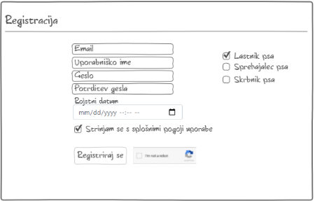
#### 3.Prijava
**Funkcionalnost:** Prijava

**Akterji:** Registriran uporabnik

 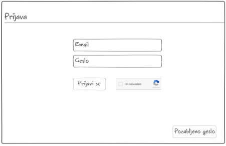
#### 4.Pozabljeno geslo
**Funkcionalnost:** Pozabljeno geslo

**Akterji:** Registriran uporabnik

 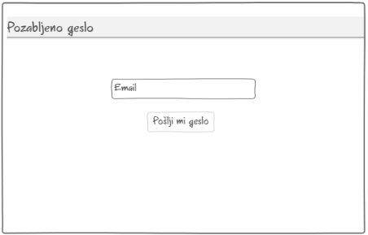
 
 ZMPonastavitevGesla
 
 
 
 
 ZMNastavitevNovegaGesla

#### 5.Objava oglasa
**Funkcionalnost:** Objava oglasa

**Akterji:** Lastnik psa, ponudniki storitev

 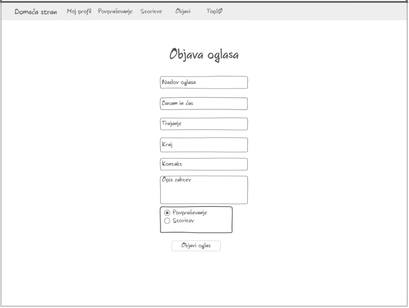
#### 6.Urejanje oglasa
**Funkcionalnost:** Urejanje oglasa

**Akterji:** Registriran uporabnik

 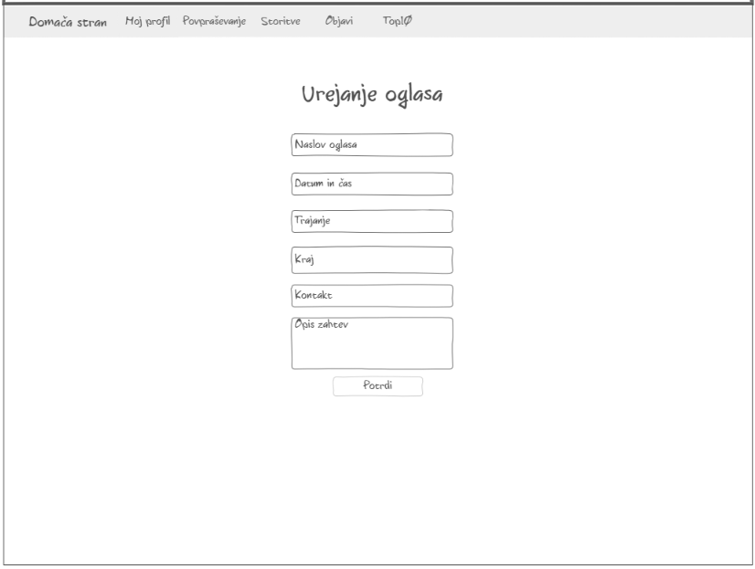
#### 7.Pregled oglasov
**Funkcionalnost:** Delitev oglasov, rezerviranje oglasov

**Akterji:** Registriran uporabnik

 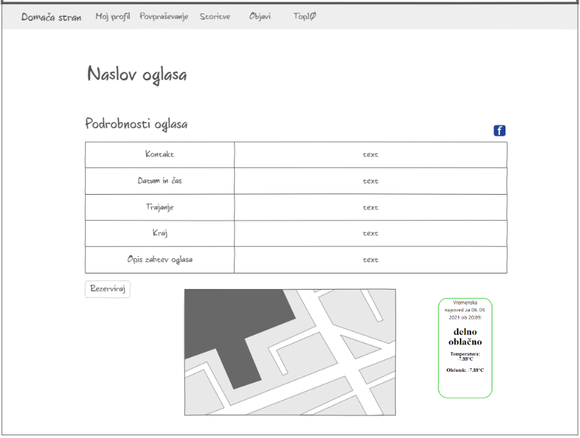
 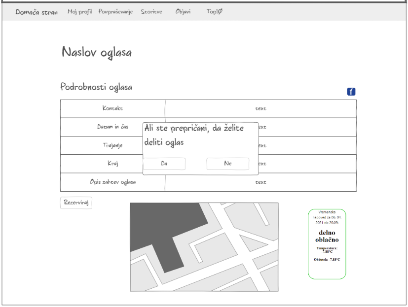
  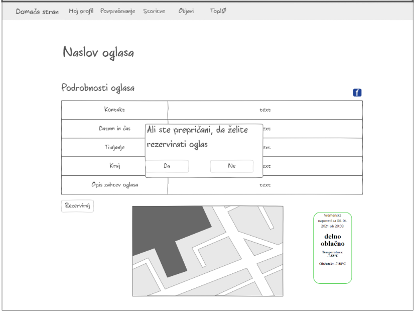

#### 8.Seznam storitev
**Funkcionalnost:** Sortiranje, filtriranje

**Akterji:** Registriran uporabnik

 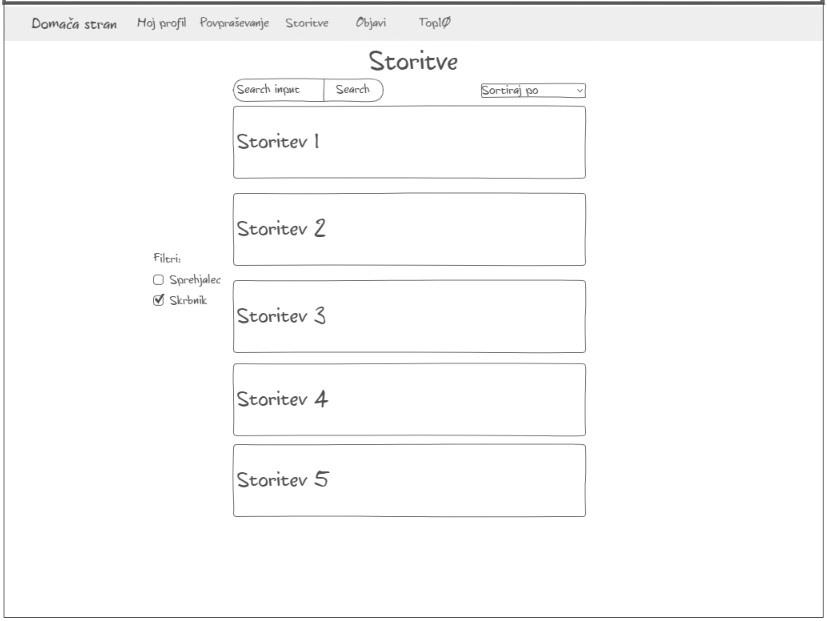
#### 9.Seznam povpraševanj
**Funkcionalnost:** Filtriranje, sortiranje

**Akterji:** Registriran uporabnik

 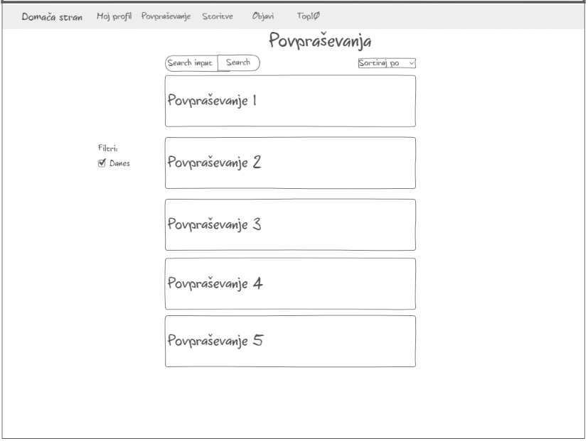
#### 10.Čin profila
**Funkcionalnost:** Razvrstitev skrbniškega čina

**Akterji:** Ponudnik storitev

 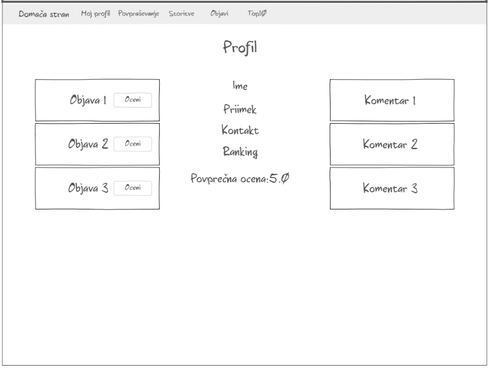

#### 11.Moderator brisanje oglasov
**Funkcionalnost:** Brisanje oglasov

**Akterji:** Moderator spletne strani

 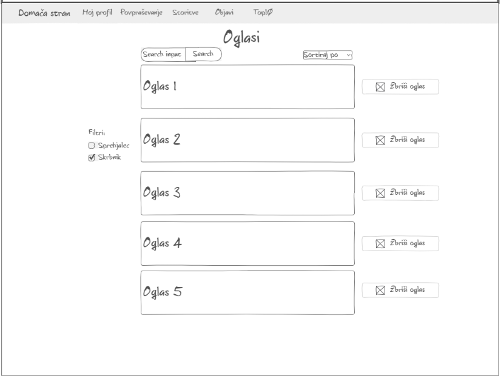
 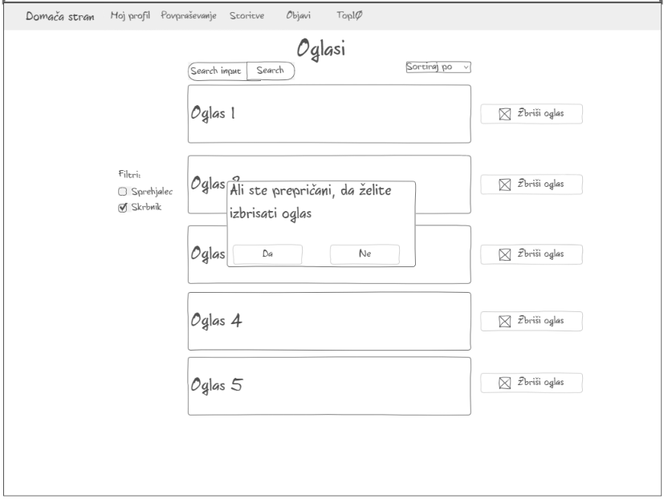

 
 #### 12.Top 10
 **Funkcionalnost:** Razvrstitev skrbniškega čina
 
 **Akterji:** Lastnik psa, ponudnik storitev
 
 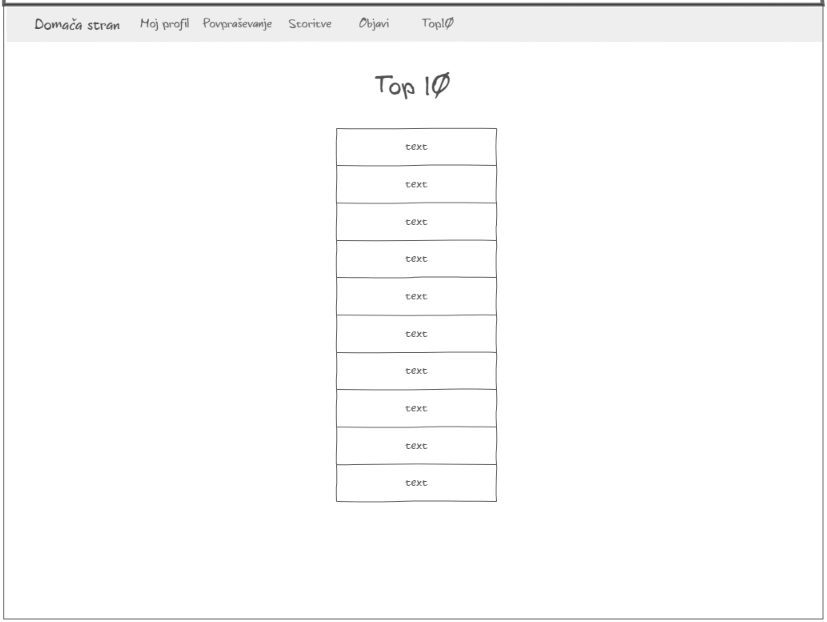
 #### 13.Ocenjevanje
 **Funkcionalnost:** Ocenjevanje in komentiranje
  
  **Akterji:** Lastnik psa
  
  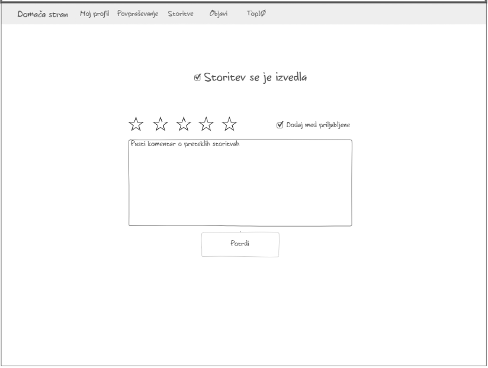

### 7.2 Sistemski vmesniki
#### Google Maps API
**Uporaba:** Google Maps API za prikaz zemljevida na oglasih.

**Opis:** Pridobimo si ključ za uporabo API-ja iz https://developers.google.com/maps.
          Ko bo registriran uporabnik kliknil na oglas se mu bodo prikazali podatki o oglasu, kjer bo naša aplikacija
          iz podatkovne baze prebrala kraj in preverila če ta kraj obstaja v GoogleMaps API-ju, če bo ugotovila,
          da obstaja bo izvedla klic z funkcijo vrniZemljevidZaKraj(kraj) na https://developers.google.com/maps in
          vrnila zemljevid za ta kraj.
#### Twitter API
**Uporaba:** Prikaz tweetov na domači strani

**Opis:** Pridobimo si kodo za uporabo widgeta iz https://developer.twitter.com/en/docs/twitter-for-websites
          Ko uporabnik odpre spletno stran se mu naloži domača stran in sproži funkcija pridobiTweete(dogs),ki
          poišče najbolj priljubljene tweete tistega dne po iskalnem nizu #dogs in jih vrne kot embedded tweete, ki so potem 
          prikazani na strani.
#### Facebook API
**Uporaba:** Delitev oglasov na svojem Facebook profilu

**Opis:** Pridobimo si kodo za uporabo plugina iz https://developers.facebook.com/docs/plugins/share-button.
          Ko si registriran uporabnik ogleduje objavljen oglas lahko z klikom na gumb "Deli oglas" sproži funkcijo
          deliNaFacebooku(oglas) in ta funkcija odpre pojavno okno, kjer uporabnik lahko doda sporočilo preden 
          deli oglas na svoj Facebook profil.   
#### OpenWeatherMap API
**Uporaba:** OpenWeatherMap API za prikaz vremena na oglasih.

**Opis:** Pridobimo si ključ za uporabo API-ja iz https://openweathermap.org/api.
          Ko bo registriran uporabnik kliknil na oglas se mu bodo prikazali podatki o oglasu, kjer bo naša aplikacija
          iz podatkovne baze prebrala kraj in preverila če ta kraj obstaja v OpenWeatherMap API-ju, če bo ugotovila,
          da obstaja bo izvedla klic s funkcijo vrniVremenskoNapoved(kraj) na https://openweathermap.org/api in vrnila
          vremensko napoved za ta kraj.          
#### Gmail API
**Uporaba:** Gmail API za pošiljanje e-poštnih sporočil neposredno iz HTML gradnika.

**Opis:** Pri potrditvi registracije in pri zahtevku za ponastavitev gesla uporabljamo e-poštni naslov preko domene Gmail. Funkcija vrniUspesnost(email) vrne 1, če je bilo sporočilo uspešno poslano, sicer vrne -1, če sporočilo ni bilo uspešno poslano.
#### reCAPTCHA API
**Uporaba:** reCAPTCHA API za preverjanje pristnosti uporabnika. 

**Opis:** V okviru funkcionalnosti Registracija in Prijava v sistem uporabljamo vmesnik za prepoznavanje pristnosti uporabnikov v spodnjem delu pred potrditvijo bodisi registracije bodisi prijave. Funkcija uspesnostRecaptcha(id, kljuc) vrne 1, če je zunanji sistem ocenil, da gre za človeškega uporabnika, oziroma -1 v nasprotnem primeru.

### 7.3 Vmesniki do naprav
Nimamo nobenih vmesnikov do naprav.
